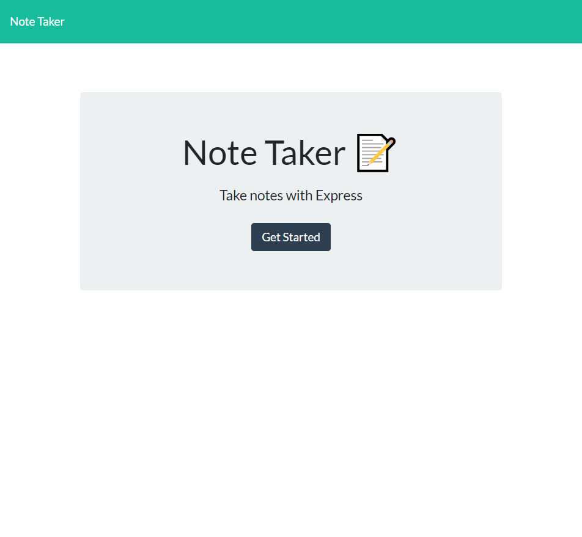
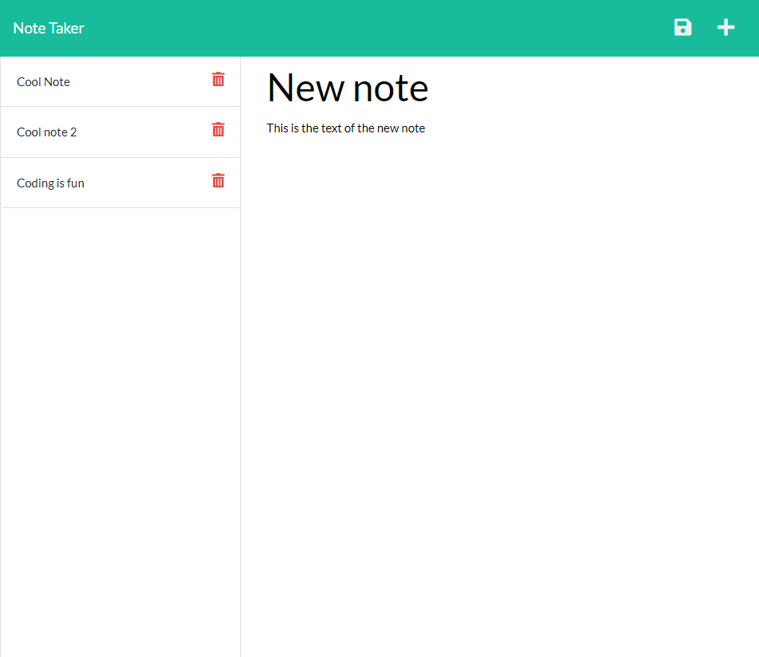

# 10 - Express.js - Super Awesome Note Taker

[](https://opensource.org/licenses/MIT)


## Contributors

[Chris Kimball](https://github.com/chirskimball "chirskimball's GitHub Profile")


## Description

The following project is an application that allows users to save notes for various uses. This application uses Express.js as a back end server to allows note data to be stored across sessions.

When the user initially loads the note taker app, the home page will be displayed. Once they click the "Get Started" button a new page will load with any previously saved notes on the left hand side and allow them to enter a new note title and body in the main content area.

The user can click the `+` icon in the upper right hand corner to prompt them to add a new note. If they fill in the note title and note text there will be a save icon right next to the `+` which will save their note to a db.json file hosted by the application.

If the user clicks on a previously saved note on the left hand navigation pane, the previously saved note title and text will be displayed in the main content area.

Each note in the right hand navigation pane will have a red trash icon that allows users to remove the specicific note from the db.json file.

Saved notes will be saved across multiple sessions and the only way to remove them is through the delete icon.


## Table of Contents 

* [Web Addresses](#web-addresses)
* [Installation](#installation)
* [Usage](#usage)
* [License](#license)
* [Techology Used](#technology-used)
* [Questions](#questions)
* [Screenshots](#screenshots)


## Web Addresses
---------------

*  [Github Repository](https://github.com/chriskimball/Super-Awesome-Note-Taker "Github Repo")
*  [Deployed Application](https://crk-super-note-taker.herokuapp.com/ "Deployed Application")


## Installation

1. Clone this Git repository
2. Navigate to repository in local directory.
3. To install any necessary dependencies, run the following command:

```bash
npm i
``` 

## Usage

You will need node.js to run this application. Once the repository has been cloned navigate to the file directory and run the following command.

```bash
node server.js
```


## License

This project is licensed under the MIT license.


## Technology Used

* Javascript
* Node.js
* Express.js npm package
* Node.js FS Module
* Node.js Path module
* Node.js UUIDv4 module


## Questions

If you have any questions about the repo, open an issue or contact me directly at [ctrain21@gmail.com](mailto:ctrain21@gmail.com). You can find more of my work at [chirskimball](https://github.com/chirskimball "chirskimball's GitHub Profile").

 
## Screenshots

### Screenshot of index page



### Screenshot of notes page

